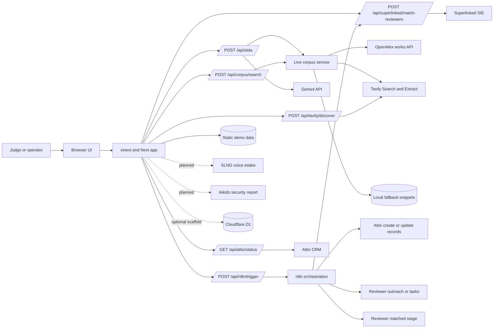

# System Architecture: Peerflow

## Overview

Peerflow is a full-stack web app for a hackathon demo of an agentic CRM workflow
for open-access research publishing. It shows how a paper can move from legal
open-access intake through author follow-up, reviewer matching, workflow
orchestration and research Q&A.

The current implementation is a polished judge-facing MVP. It uses static demo
workflow data for the paper queue, reviewers and fallback snippets, while Aida
retrieves live open-access abstracts through OpenAlex and can supplement them
with Tavily extraction. Live Gemini, Superlinked SIE, Attio read/write and n8n
webhook calls are enabled when the required environment variables are present.
The n8n production webhook is published and accepts `paper.submitted` payloads.
The repository now includes `n8n/peerflow-hackathon-orchestration.json`, an
importable workflow with downstream Attio write, reviewer matching,
outreach/task and stage-update nodes. The remaining n8n verification is to
confirm the signed-in n8n Cloud canvas exactly matches that file. The Aikido
report URL is shown as
external security evidence. SLNG is represented in the UI, agent log and
environment model, but the repository does not yet contain a production
voice-intake endpoint.

Peerflow is not a Sci-Hub clone. Its intended boundary is legal open-access
metadata, abstracts and authorised links.

## Key Requirements

- Present an end-to-end agent workflow that judges can run locally.
- Keep API keys and service credentials on the server side.
- Support a mock-first demo path so the product remains usable without live
  partner credentials.
- Use legal open-access research metadata and citation evidence.
- Let Aida answer only when supporting corpus evidence is available.
- Use n8n as the orchestration layer for CRM writes, reviewer matching,
  outreach and paper-stage updates.
- Use Superlinked SIE for semantic reviewer matching when configured.
- Make future Attio, SLNG and Aikido integrations clear and pluggable via
  environment variables.
- Avoid overstating production readiness: persistence, authentication,
  observability and compliance controls are still limited.

## High-Level Architecture

The system boundary is the Peerflow web app and its server routes. The browser
only receives rendered UI state and API responses. Credentials are read from
server environment variables and are not intentionally sent to the client.
Static demo data is still the source of truth for the CRM workflow queue and
fallback behaviour. Aida's primary evidence source is now live OpenAlex/Tavily
retrieval. The n8n webhook currently proves orchestration hand-off; the
prepared import file defines the intended full workflow. D1 support exists as
scaffolded infrastructure, but no application data is currently persisted there.

## Component Details

### Web App Shell

- Responsibilities: render the main Peerflow demo surface, show integration
  readiness, and pass mock papers, reviewers, workflow steps and corpus data to
  client components.
- Main technologies: Next.js app router conventions through vinext, React 19,
  TypeScript and Tailwind CSS.
- Data owned or transformed: reads static arrays from `app/data.ts` and converts
  server environment presence into integration status booleans.
- External dependencies: none at render time beyond server environment
  variables.
- Failure modes or operational concerns: the UI can show a service as connected
  when the relevant variable exists even if the external service itself is not
  reachable. This is readiness signalling, not a full health check.

### Agent Console

- Responsibilities: provide the interactive "Run agent" workflow, simulate
  paper intake stages, display an Attio-style record preview, emit one
  `paper.submitted` event to n8n and show which downstream actions n8n owns.
- Main technologies: React client component with local component state and
  browser `fetch`.
- Data owned or transformed: selected paper ID, completed workflow step IDs,
  n8n trigger status, planned reviewer preview and transient log entries.
- External dependencies: calls `POST /api/n8n/trigger` during the agent run.
  The Attio and Superlinked routes remain available for health checks or n8n
  workflow calls.
- Failure modes or operational concerns: the log and stage state are not
  persisted. Refreshing the page loses the run history.

### Aida Assistant

- Responsibilities: let a user ask predefined research questions, display the
  answer, citation trace, evidence coverage and refusal behaviour.
- Main technologies: React client component with local state and browser
  `fetch`.
- Data owned or transformed: selected question ID, live or mock answer payload,
  live corpus previews and matching article citations.
- External dependencies: calls `POST /api/aida` and `POST /api/corpus/search`.
- Failure modes or operational concerns: live retrieval is request-time only and
  not persisted. Aida's refusal behaviour is implemented for patient-specific
  treatment advice, but a production retrieval system would need stronger
  evaluation and logging.

### Aida API Route

- Responsibilities: retrieve live open-access evidence for a selected question,
  refuse patient-specific treatment advice before model invocation, call Gemini
  when configured, and validate returned citations against the allowed set.
- Main technologies: Next-style `POST` route, TypeScript, server-side `fetch`.
- Data owned or transformed: `questionId`, query mappings, live article
  snippets, Gemini JSON output and final Aida response shape.
- External dependencies: Gemini API via `AIDA_MODEL_API_KEY` or
  `GEMINI_API_KEY`; model name defaults to `gemini-3.5-flash`. Corpus retrieval
  uses OpenAlex and adds Tavily extraction when `TAVILY_API_KEY` is present.
- Failure modes or operational concerns: model failures return a mock fallback
  with HTTP 200. This is useful for demos but should be revisited for production
  monitoring and error handling.

### Live Corpus Retrieval

- Responsibilities: search legal open-access sources, reconstruct OpenAlex
  abstracts, extract compact evidence snippets and provide fallback article
  cards to Aida and the UI.
- Main technologies: TypeScript helper in `app/lib/openAccessCorpus.ts`, server
  routes and server-side `fetch`.
- Data owned or transformed: query text, OpenAlex works responses, Tavily search
  results, Tavily extracts and normalised `CorpusArticle` objects.
- External dependencies: OpenAlex works API; optional `OPENALEX_API_KEY`;
  optional Tavily API via `TAVILY_API_KEY`.
- Failure modes or operational concerns: request-time retrieval is not cached or
  persisted. OpenAlex anonymous requests have a small free daily budget; serious
  use should configure an OpenAlex API key and add persistence.

### Superlinked Matching API Route

- Responsibilities: semantically match paper profiles against reviewer profiles
  and normalise SIE scores into judge-friendly fit percentages.
- Main technologies: Next-style `POST` route, TypeScript and
  `@superlinked/sie-sdk`.
- Data owned or transformed: selected paper title, abstract and field; reviewer
  expertise, institution and past review topics; raw SIE scores; normalised fit
  values; and fallback reviewer matches.
- External dependencies: Superlinked SIE endpoint and key. The default rerank
  model is `cross-encoder/ms-marco-MiniLM-L-6-v2`, with GPU lane defaulting to
  `l4`.
- Failure modes or operational concerns: missing credentials, cold capacity,
  timeout or scoring errors return mock reviewer matches. The client labels
  whether the source was live or mock.

### Attio Status API Route

- Responsibilities: validate that the configured Attio API key can read the
  workspace object configuration.
- Main technologies: Next-style `GET` route, TypeScript and server-side
  `fetch`.
- Data owned or transformed: Attio object names such as `companies` and
  `people`, returned as a small status payload.
- External dependencies: Attio API via `ATTIO_API_KEY` and
  `ATTIO_WORKSPACE_ID`.
- Failure modes or operational concerns: this route is intentionally read-only.
  Missing or invalid credentials return a mock/fallback status. Live CRM write
  proof is handled by `scripts/seed-attio-peerflow.mjs` and the prepared n8n
  workflow, not by this status route.

### Attio Seed Script

- Responsibilities: create or update demo companies, people and reviewer
  outreach tasks in Attio for the three sample Peerflow papers.
- Main technologies: Node.js script using Attio REST API calls.
- Data owned or transformed: demo institution domains, demo author emails,
  company records, person records and follow-up tasks.
- External dependencies: Attio API via `ATTIO_API_KEY`.
- Failure modes or operational concerns: the script creates real CRM records in
  the configured workspace. It uses safe demo identifiers, but should not be run
  against a production workspace without review.

### n8n Trigger API Route

- Responsibilities: send one `paper.submitted` event to the configured n8n
  webhook, including the selected paper, Attio record previews, required n8n
  actions and the reviewer-matching backend callback URL.
- Main technologies: Next-style `POST` route, TypeScript and server-side
  `fetch`.
- Data owned or transformed: selected paper metadata, generated event ID, Attio
  record preview objects and n8n orchestration instructions.
- External dependencies: `N8N_WEBHOOK_URL`; optional `PEERFLOW_PUBLIC_URL` so
  n8n Cloud can call Peerflow backend routes from outside localhost.
- Failure modes or operational concerns: the production n8n webhook is
  published and accepts the payload. The downstream workflow nodes are prepared
  in `n8n/peerflow-hackathon-orchestration.json`, but still need to be imported
  and published in n8n Cloud. Test webhooks may return `404` unless the n8n
  workflow is actively listening. The route returns a clearer mock/fallback
  status rather than blocking the demo.

### Attio Webhook

- Responsibilities: send Attio `record.created`, `record.updated`,
  `task.created` and `task.updated` events to n8n.
- Main technologies: Attio developer webhook configuration.
- Data owned or transformed: record and task event notifications from Attio.
- External dependencies: production n8n webhook URL.
- Failure modes or operational concerns: the current target is the same n8n
  production path used for Peerflow's `paper.submitted` event. This is adequate
  for a hackathon demo receiver, but production should split Attio inbound
  events and Peerflow submission events into separate n8n webhooks.

### Tavily Discovery API Route

- Responsibilities: search open-access-friendly sources and extract text from
  the top allowed source URL for direct source discovery and live corpus
  fallback.
- Main technologies: Next-style `POST` route, TypeScript and server-side
  `fetch`.
- Data owned or transformed: search query, source title, URL, host, score and
  extracted snippet.
- External dependencies: Tavily API via `TAVILY_API_KEY`.
- Failure modes or operational concerns: Tavily results are bounded to an
  allow-list of open-access-friendly domains. They are not used to bypass
  Aida's citation guardrails or answer patient-specific treatment advice.

### Static Demo Data

- Responsibilities: provide demo papers, reviewer candidates, workflow steps,
  fallback corpus articles and supported Aida questions/search queries.
- Main technologies: TypeScript exports in `app/data.ts`.
- Data owned or transformed: paper metadata, abstracts, reviewer profiles,
  workflow copy and corpus evidence snippets.
- External dependencies: none.
- Failure modes or operational concerns: data changes require a code change.
  There is no admin interface, database write path or ingestion pipeline yet.

### Database Scaffold

- Responsibilities: prepare for future Cloudflare D1 access through Drizzle ORM.
- Main technologies: Drizzle ORM, Drizzle Kit and a `getDb()` helper for D1.
- Data owned or transformed: none in the current application. `db/schema.ts` is
  intentionally empty.
- External dependencies: optional Cloudflare D1 binding named `DB`.
- Failure modes or operational concerns: `.openai/hosting.json` currently has
  `d1` and `r2` set to `null`, so no D1 or R2 binding is active by default.

### Worker and Build Layer

- Responsibilities: package the app for vinext, Vite and Cloudflare
  Worker-compatible output; handle the vinext image optimisation route.
- Main technologies: vinext, Vite, Cloudflare Vite plugin, Cloudflare Worker
  entry point and a small Sites packaging plugin.
- Data owned or transformed: build output, `.openai/hosting.json` metadata and
  optional Drizzle migrations copied into `dist/.openai`.
- External dependencies: Cloudflare runtime APIs for assets, image transforms
  and optional D1.
- Failure modes or operational concerns: local development runs through
  `vinext dev`; production deployment details are not fully documented in the
  repository yet.

## Data Flow

### Agent Workflow

1. The judge opens the web app and selects one of the static open-access paper
   entries.
2. The browser runs the local agent sequence in `AgentConsole`.
3. For each step, the UI marks progress and writes a transient log entry.
4. On the submission step, the browser posts the selected paper ID to
   `/api/n8n/trigger`.
5. The server route builds a `paper.submitted` event with paper metadata, Attio
   record previews, an n8n orchestration contract and a reviewer-matching
   callback URL.
6. n8n receives the event and owns the downstream workflow.
7. n8n calls Attio to create or update author and institution demo records
   using the same payload shapes proven by `npm run attio:seed`.
8. n8n calls `/api/superlinked/match-reviewers` through the callback URL in the
   payload, or Superlinked directly, to get top 3 semantic reviewer matches.
9. n8n creates a reviewer outreach or follow-up task payload that carries those
   matches into Attio.
10. n8n updates the paper stage to `Reviewer matched`.
11. Current verifiable state: the production webhook accepts the payload and
    the importable workflow JSON contains these downstream nodes.
12. The browser renders the n8n trigger status, planned reviewer preview and
    Attio-style record preview.

### Aida Q&A Flow

1. The judge selects a predefined question in the Aida panel.
2. The browser posts the question ID to `/api/aida`.
3. The route loads the matching question and maps it to a stronger live search
   query.
4. If the question asks for patient-specific treatment advice, the route refuses
   before calling Gemini.
5. The live corpus helper queries OpenAlex for open-access works with usable
   abstracts.
6. If OpenAlex returns too little evidence and Tavily is configured, the helper
   searches/extracts from allowed open-access-friendly domains.
7. If live retrieval fails, the route falls back to the local snippets for the
   selected question.
8. If Gemini is configured, the route sends only the retrieved evidence snippets
   and asks for JSON.
9. The route accepts the answer only if at least one returned citation is in the
   retrieved evidence set.
10. The browser displays the answer, confidence, coverage and cited evidence.

## Data Model

The current durable data model is static and in-memory at runtime. Aida also
creates transient live corpus records during API calls.

| Entity | Current fields | Current storage |
| --- | --- | --- |
| Paper | `id`, `title`, `source`, `author`, `institution`, `field`, `licence`, `abstract` | `app/data.ts` |
| Reviewer | `name`, `institution`, `speciality`, `fit`, `availability` | `app/data.ts` |
| Workflow step | `id`, `title`, `owner`, `detail` | `app/data.ts` |
| Corpus article | `id`, `title`, `source`, `licence`, `year`, `evidence`, optional `url`, `authors` | `app/data.ts` fallback or live retrieval |
| Aida question | `id`, `question`, optional `searchQuery`, `answer`, `confidence`, `coverage`, `citations` | `app/data.ts` |
| Agent run log | `id`, `label`, `detail` | Browser component state only |

There is no durable application database for the main workflow yet. Drizzle and
D1 are available as a future path, but the schema contains no tables.

## Infrastructure and Deployment

- Runtime: Node.js `>=22.13.0` for local development and build commands.
- Frameworks: vinext with Next.js app router conventions and Vite.
- Local development: `npm run dev`, usually served at `http://localhost:3000/`.
- Build: `npm run build`, which runs `vinext build`.
- Production start: `npm run start`, which runs `vinext start`.
- Cloudflare compatibility: `worker/index.ts` provides a Worker entry point and
  image optimisation route. `vite.config.ts` wires the Cloudflare Vite plugin.
- Sites packaging: `build/sites-vite-plugin.ts` copies hosting metadata and
  Drizzle migrations into `dist/.openai` during builds.
- Hosting config: `.openai/hosting.json` currently has no D1 or R2 binding.

Current deployment URL is not recorded in the repository. Use `<ADD DETAIL>` if
this document is published before a public URL exists.

## Scalability and Reliability

The current architecture prioritises demo reliability over scale. Static
fallback data keeps the app deterministic and allows it to run without external
services.
Server routes fall back to mock responses when Gemini or Superlinked cannot be
used, which makes the live demo less fragile.

Limits and risks:

- No persistent state for agent runs, submissions or audit trails.
- No queueing, retry policy or background workflow runner.
- External AI, corpus and SIE calls are synchronous request-response operations.
- Gemini, corpus and SIE failures are hidden behind mock fallbacks, so production
  monitoring would need clearer error reporting.
- n8n orchestration is triggered during the agent run. The cloud workflow
  currently proves webhook acceptance; the prepared import file defines the
  full downstream workflow but still needs to be published. There is no durable
  run-status polling or retry mechanism yet.
- Attio record creation is not implemented in the browser route. The app
  previews the record shape and uses a read-only Attio validation route. Live
  Attio write proof exists through the seed script and prepared n8n import
  workflow.

Future scale should introduce a durable store, explicit job status, retries,
provider timeouts, idempotency keys and persisted audit logs.

## Security and Compliance

### Secrets Management

Secrets are expected in `.env.local` for local development and platform-managed
environment variables for deployment. The app uses server environment variables
for Gemini, Superlinked, Attio, n8n, SLNG, Aikido, Tavily and open-access source
configuration. No `NEXT_PUBLIC_` secrets are used.

The UI displays environment variable names and connection status, but should not
display secret values. `.env.local` must remain uncommitted.

### Client and Server Trust Boundary

The browser can call six server routes:

- `POST /api/aida`
- `POST /api/corpus/search`
- `GET /api/attio/status`
- `POST /api/n8n/trigger`
- `POST /api/superlinked/match-reviewers`
- `POST /api/tavily/discover`

The client controls `questionId` and `paperId`. The server selects papers from
known static lists, builds the `paper.submitted` payload, constrains corpus
search to legal open-access-friendly sources, keeps provider credentials
server-side and treats all client-provided workflow payload fields as demo data
rather than trusted CRM records.

`AIKIDO_REPORT_URL` is exposed to the browser as an external report link. It
should only contain a public or shareable report URL, not a private token or API
credential.

### Authentication and Authorisation

There is no active application authentication or role-based authorisation in the
current UI. A ChatGPT authentication helper exists in `app/chatgpt-auth.ts`, but
it is not wired into the demo pages or API routes. If Peerflow moves beyond a
judge demo, authentication should be added before handling real submissions,
reviewer identities or private author communications.

### Sensitive Data Handling

The demo stores only mock paper metadata, fallback abstracts and fallback
evidence snippets in the repository. Live corpus retrieval uses legal
open-access metadata, abstracts and authorised links. Full copyrighted paper
text, paywalled content and private medical or personal data should not be
ingested without a clear legal basis and access policy.

### Third-Party Provider Risk

Gemini receives the selected question and cited evidence snippets. Superlinked
SIE receives paper and reviewer profile text. If real author or reviewer data is
added, the app needs provider review, data minimisation, retention rules and
clear consent or contractual basis.

### Auditability and Logging

The UI shows an in-session agent log, but it is not persisted. A production
version should store provider calls, selected evidence, reviewer match inputs,
outputs, user actions and workflow events in an audit table with appropriate
redaction.

## Observability

Current observability is minimal:

- `npm run lint` verifies static code quality.
- `npm run build` verifies the production build.
- API routes return `mode` and `source` fields so the UI can show whether a
  response came from live or mock execution.
- There is no structured logging, tracing, metrics dashboard, uptime check or
  error reporting integration in the repository.

Recommended additions:

- Structured server logs for route calls, provider mode and failure reason.
- Request IDs across agent runs and provider calls.
- Persisted audit trail for Aida answers, retrieved corpus records and reviewer
  matches.
- Health checks for Gemini, Superlinked, n8n and Attio.
- Build and deployment status badges once CI is configured.

## Design Decisions and Trade-offs

- Mock-first architecture: keeps the hackathon demo reliable without keys, but
  does not prove full production integration behaviour.
- Server-side provider calls: protects credentials and gives a clear trust
  boundary, but adds backend responsibility for validation and observability.
- Live corpus retrieval: gives Aida fresh open-access evidence, but it is not
  yet cached, persisted, vector-ranked or human-reviewed.
- Gemini fallback to mock answer: preserves demo flow during provider issues,
  but production systems should expose failures more explicitly.
- Superlinked reranking route: demonstrates semantic reviewer matching with a
  real side-challenge service, while keeping local mock scores as a safety net.
- No active database: reduces implementation complexity for the MVP, but limits
  auditability, collaboration, repeatability and CRM-grade workflow state.
- Environment-variable integration model: makes partner services pluggable, but
  connection status currently checks configuration presence rather than live
  service health.

## Future Improvements

- Confirm the signed-in n8n Cloud workflow exactly matches the importable
  workflow JSON for Attio writes, reviewer matching, outreach/follow-up tasks
  and stage updates.
- Persist n8n workflow run IDs and poll execution status.
- Add the production SLNG voice capture endpoint behind the existing structured
  intake proof shown in the agent log.
- Persist live Aida corpus results and add a legal open-access ingestion/vector
  retrieval pipeline.
- Persist Aida answer traces, reviewer match decisions and agent workflow logs.
- Add authentication and role-based access before handling real submissions.
- Add Drizzle tables for papers, authors, reviewers, corpus records, agent runs
  and audit events.
- Add provider health checks and clearer failure reporting.
- Attach Aikido scan output and link it to build or release evidence.
- Add automated tests for API route fallback behaviour, citation validation and
  core UI states.
- Record the public deployment URL and deployment procedure once available.
