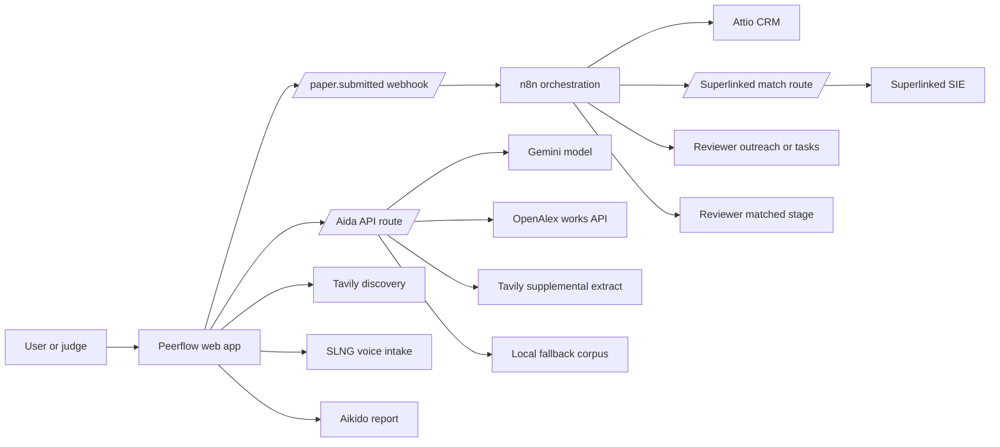

# Peerflow

Agentic CRM for open-access research publishing.

## Badges

No CI, coverage or deployment badges are configured yet.

## Description

Peerflow is a hackathon MVP for the Attio Agentic CRM track. It helps
open-access publishers and research communities intake papers, manage authors,
match reviewers, automate review workflows and answer research questions from
cited corpus evidence.

The app is built as a judge-facing demo. It can run fully in mock mode, while
real integrations are enabled through environment variables. The project is
explicitly not a Sci-Hub clone: it does not bypass paywalls and should only use
legal open-access metadata, abstracts and authorised links.

## Table of Contents

- [Features](#features)
- [Tech Stack](#tech-stack)
- [Architecture Overview](#architecture-overview)
- [Live Integration Status](#live-integration-status)
- [Installation](#installation)
- [Usage](#usage)
- [Configuration](#configuration)
- [Screenshots or Demo](#screenshots-or-demo)
- [API Reference](#api-reference)
- [Tests](#tests)
- [Sponsor Usage](#sponsor-usage)
- [Submission Guide](#submission-guide)
- [Roadmap](#roadmap)
- [Contributing](#contributing)
- [Licence](#licence)
- [Contact or Support](#contact-or-support)

## Features

- Paper intake for legitimate open-access research sources.
- n8n-centred orchestration for Attio CRM records, reviewer matching, outreach
  and stage updates.
- Importable n8n workflow JSON for the hackathon orchestration path.
- Superlinked SIE semantic reviewer matching exposed as a backend route n8n can
  call: `all-MiniLM-L6-v2` embeddings plus `ms-marco-MiniLM-L-6-v2` reranking.
- Aida, a corpus-grounded assistant with live OpenAlex/Tavily retrieval and a
  no-citation, no-claim rule.
- Tavily Search and Extract for supplemental open-access source discovery.
- n8n webhook triggering with a single `paper.submitted` event.
- SLNG readiness and an Aikido security report link for the hackathon side
  challenges.
- Mock-first demo data so the product works without live credentials.
- Server-side API routes that keep API keys out of the browser.

## Tech Stack

- Node.js `>=22.13.0`
- Next.js `16.2.9`
- React `19.2.6`
- vinext `0.0.50`
- Vite `8.1.0`
- Tailwind CSS `4.2.1`
- TypeScript `5.9.3`
- Superlinked SIE SDK `0.6.14`
- Drizzle ORM `0.45.2` with optional D1 scaffolding
- Cloudflare Worker-compatible Sites build output

## Architecture Overview



The web app renders the demo surface and calls server-side API routes for model
work. Aida retrieves live open-access abstracts through OpenAlex, supplements
them with Tavily extraction when needed, and then asks Gemini to answer only
from cited evidence. For the agent workflow, Peerflow emits one
`paper.submitted` webhook to n8n. n8n is the orchestration layer: it receives
the event, calls Attio to create or update records, calls Peerflow's
Superlinked reviewer-matching route or Superlinked directly, creates reviewer
outreach or follow-up tasks, and updates the paper stage to
`Reviewer matched`. The current n8n production webhook is published and accepts
the event payload; the repository workflow JSON contains the downstream nodes
for the full orchestration path.
SLNG and Aikido are configured through environment variables so live services
can be plugged in without exposing credentials to the browser.

## Live Integration Status

| Service | How Peerflow uses it | Current status |
| --- | --- | --- |
| Attio | CRM system for authors, institutions and follow-up tasks. | REST API read/write is live. `npm run attio:seed` has created demo companies, people and follow-up tasks. Native Attio visual workflow setup and a custom paper object are not implemented. |
| n8n | Orchestration layer for `paper.submitted`. | Production webhook is published and accepts events. Importable workflow nodes in `n8n/peerflow-hackathon-orchestration.json` receive the event, call Attio, call reviewer matching, create outreach tasks and return `Reviewer matched`. |
| Superlinked | Semantic reviewer matching through Superlinked's open-source inference engine. Paper title, abstract and field are embedded with `all-MiniLM-L6-v2`; reviewer expertise, institution and past topics are embedded too; matches are reranked with `ms-marco-MiniLM-L-6-v2`. | Backend route returns top 3 reviewer matches with fit scores, such as `Amara Osei, 94% fit`; n8n pushes those matches into the Attio follow-up task payload. |
| Tavily | Open-access source search and extraction. | Live when `TAVILY_API_KEY` is configured. |
| Aida/Gemini/OpenAlex | Corpus-grounded Q&A over legal open-access evidence. | Live retrieval via OpenAlex; Gemini answers when a model key is configured, with citation validation and fallback behaviour. |
| SLNG | Voice intake for author submission briefs. | The agent log shows `Voice intake parsed by SLNG`, then the structured paper record is visible. Production voice capture is still planned. |
| Aikido | Security evidence link for judges. | Report URL is shown in the integration grid when configured. |

## Installation

Clone the repository and install the locked dependencies:

```bash
git clone git@github.com:MasteraSnackin/Peerflow.git
cd Peerflow
npm ci
```

The project requires Node.js `>=22.13.0`.

## Usage

Start the local development server:

```bash
npm run dev
```

Open the app:

```text
http://localhost:3000/
```

Useful commands:

```bash
npm run lint
npm run build
npm run start
npm run attio:seed
npm run db:generate
```

Typical demo flow:

1. Open Peerflow locally.
2. Ask Aida a supported research question and show the live cited evidence
   trace.
3. Ask Aida an unsupported question and show the refusal behaviour.
4. Search open sources with Tavily and show the candidate source.
5. Click `Run agent`.
6. Show Peerflow sending one `paper.submitted` event to n8n.
7. Explain that n8n owns Attio upserts, reviewer matching, outreach/tasks and
   the `Reviewer matched` stage update.
8. Open `n8n/peerflow-hackathon-orchestration.json` if judges ask to inspect
   the workflow structure.
9. Open the Aikido security report from the integration grid.
10. Explain the SLNG proof: author speaks, SLNG turns the request into
    structured text, and Peerflow extracts title, field, author, institution
    and summary for the paper intake record.

## Configuration

Create `.env.local` from `.env.example` and fill in only the services you want
to run live.

```bash
ATTIO_API_KEY=
ATTIO_WORKSPACE_ID=
N8N_WEBHOOK_URL=
PEERFLOW_PUBLIC_URL=
SLNG_API_KEY=
SUPERLINKED_ENDPOINT=
SUPERLINKED_API_KEY=
SUPERLINKED_EMBEDDING_MODEL=sentence-transformers/all-MiniLM-L6-v2
SUPERLINKED_RERANK_MODEL=cross-encoder/ms-marco-MiniLM-L-6-v2
SUPERLINKED_GPU=l4
SUPERLINKED_TIMEOUT_MS=45000
SUPERLINKED_PROVISION_TIMEOUT_MS=90000
AIKIDO_REPORT_URL=
GEMINI_API_KEY=
AIDA_MODEL_API_KEY=
AIDA_GEMINI_MODEL=gemini-3.5-flash
AIDA_VECTOR_INDEX_URL=
AIDA_EMBEDDING_MODEL=
TAVILY_API_KEY=
OPENALEX_API_KEY=
OPENALEX_EMAIL=
UNPAYWALL_EMAIL=
SEMANTIC_SCHOLAR_API_KEY=
```

Environment variable notes:

| Variable | Purpose |
| --- | --- |
| `ATTIO_API_KEY` | Attio API key for workspace validation and live demo CRM writes. |
| `ATTIO_WORKSPACE_ID` | Target Attio workspace identifier. |
| `N8N_WEBHOOK_URL` | n8n production webhook that receives `paper.submitted`. |
| `PEERFLOW_PUBLIC_URL` | Optional deployed or tunnelled base URL so n8n Cloud can call Peerflow backend routes. |
| `SLNG_API_KEY` | SLNG voice intake integration for structured paper intake. |
| `SUPERLINKED_ENDPOINT` | SIE cluster endpoint. |
| `SUPERLINKED_API_KEY` | SIE authentication key. |
| `SUPERLINKED_EMBEDDING_MODEL` | Semantic embedding model for paper and reviewer profiles. |
| `SUPERLINKED_RERANK_MODEL` | Reviewer reranking model. |
| `SUPERLINKED_GPU` | SIE GPU lane, default `l4`. |
| `AIKIDO_REPORT_URL` | Link shown in the UI for repository security evidence. |
| `GEMINI_API_KEY` | Gemini API key for Aida. |
| `AIDA_MODEL_API_KEY` | Alternative Gemini key name for Aida. |
| `AIDA_GEMINI_MODEL` | Gemini model used by Aida. |
| `AIDA_VECTOR_INDEX_URL` | Future vector index for the research corpus. |
| `AIDA_EMBEDDING_MODEL` | Future embedding model for corpus retrieval. |
| `TAVILY_API_KEY` | Tavily Search and Extract for supplemental open-access source discovery. |
| `OPENALEX_API_KEY` | Optional OpenAlex API key. Anonymous OpenAlex requests have a small free budget. |
| `OPENALEX_EMAIL` | Legacy OpenAlex contact value; not a substitute for an API key. |
| `UNPAYWALL_EMAIL` | Optional Unpaywall API contact. |
| `SEMANTIC_SCHOLAR_API_KEY` | Optional Semantic Scholar API key. |

Do not commit `.env.local`. The repository ignores local environment files by
default.

## Screenshots or Demo

Local demo URL:

```text
http://localhost:3000/
```

Deployment URL:

```text
<ADD DEPLOYED URL>
```

Suggested demo line:

> Peerflow turns open-access publishing into an agentic CRM workflow, and Aida
> answers research questions only when it can cite corpus evidence.

## API Reference

### `POST /api/aida`

Runs Aida against live open-access evidence. The route retrieves OpenAlex
abstracts for the selected question, adds Tavily extraction when configured, and
asks Gemini to answer using only the cited evidence. Static snippets are used
only as a fallback. Patient-specific treatment advice is refused before model
invocation.

Request:

```json
{
  "questionId": "clinical-triage"
}
```

Response:

```json
{
  "answer": "string",
  "confidence": "High",
  "coverage": "1 cited passage",
  "citations": ["C1"],
  "mode": "live",
  "source": "gemini-3.5-flash + live open-access corpus",
  "query": "multimodal retrieval clinical evidence review medical images notes trial metadata",
  "articles": [
    {
      "id": "OA1",
      "title": "string",
      "source": "OpenAlex live - arXiv",
      "licence": "Open access",
      "year": "2026",
      "evidence": "string",
      "url": "https://..."
    }
  ]
}
```

### `POST /api/corpus/search`

Retrieves the live open-access corpus for a question without asking Gemini.
This powers the UI's `Refresh corpus` action.

Request:

```json
{
  "questionId": "clinical-triage"
}
```

Response:

```json
{
  "mode": "live",
  "source": "OpenAlex returned 4 open-access abstracts",
  "query": "multimodal retrieval clinical evidence review medical images notes trial metadata",
  "articles": [],
  "providerStatuses": ["OpenAlex returned 4 open-access abstracts"]
}
```

### `POST /api/superlinked/match-reviewers`

Uses Superlinked SIE for semantic reviewer matching. Peerflow embeds the paper
title, abstract and field with `all-MiniLM-L6-v2`, embeds reviewer expertise,
institution and past review topics, then reranks candidates with
`ms-marco-MiniLM-L-6-v2`. This is matching by research meaning, not keyword
overlap. The route falls back to local mock reviewer scores if SIE is
unavailable, cold or missing credentials.

Request:

```json
{
  "paperId": "paper-01"
}
```

Response:

```json
{
  "matches": [
    {
      "name": "Amara Osei",
      "institution": "Imperial College London",
      "speciality": "Clinical retrieval",
      "fit": 94,
      "availability": "2 reviews open"
    }
  ],
  "mode": "live",
  "pipeline": {
    "embeddingModel": "sentence-transformers/all-MiniLM-L6-v2",
    "rerankModel": "cross-encoder/ms-marco-MiniLM-L-6-v2",
    "embeddingStatus": "embedded 4 profiles into 384-dimensional dense vectors",
    "matchingMethod": "Superlinked semantic embedding plus reranking, not keyword search",
    "profileInputs": "paper title + abstract + field vs reviewer expertise + institution + past review topics",
    "embeddingDimensions": 384
  },
  "source": "sentence-transformers/all-MiniLM-L6-v2 -> cross-encoder/ms-marco-MiniLM-L-6-v2"
}
```

### `GET /api/attio/status`

Validates that the configured Attio key can read workspace objects. This is a
read-only check; it does not create CRM records.

Response:

```json
{
  "mode": "live",
  "source": "2 Attio objects available",
  "objects": ["companies", "people"]
}
```

### `npm run attio:seed`

Creates or updates the live Attio demo CRM sequence through the REST API:
companies, people and reviewer outreach tasks for the three sample Peerflow
papers. It uses safe demo email/domain identifiers and reads the Attio key from
`.env.local`.

The active Attio developer webhook currently sends `record.created`,
`record.updated`, `task.created` and `task.updated` events to the production
n8n webhook URL configured in `.env.local`.

### `POST /api/n8n/trigger`

Sends one `paper.submitted` event to the configured n8n webhook. If the webhook
is missing or unavailable, the route returns a mock/fallback result so the demo
flow can continue.
For n8n test webhook URLs, a `404` usually means the workflow is not actively
listening; use `Execute workflow` in n8n or switch to the production
`/webhook/...` URL from an activated workflow.

The published Peerflow n8n webhook currently proves payload acceptance. The
workflow import file defines the downstream orchestration path:

1. Receive one `paper.submitted` webhook event from Peerflow.
2. Call Attio to create or update institution and author records.
3. Call Peerflow's `/api/superlinked/match-reviewers` backend, or Superlinked
   directly, to get reviewer matches.
4. Create an Attio reviewer outreach or follow-up task with the match scores.
5. Return the final paper stage as `Reviewer matched`.

Unknown: the repository can verify the importable workflow JSON, but the exact
n8n Cloud canvas still has to match this JSON in the signed-in workspace.

Request:

```json
{
  "paperId": "paper-01",
  "event": "paper.submitted"
}
```

Response:

```json
{
  "mode": "live",
  "event": "paper.submitted",
  "source": "n8n webhook accepted workflow payload",
  "runId": "00000000-0000-4000-8000-000000000000",
  "orchestrationOwner": "n8n",
  "nextStage": "Reviewer matched"
}
```

### `POST /api/tavily/discover`

Searches open-access-friendly sources through Tavily, then extracts text from
the top allowed source URL. Aida can now use Tavily as live corpus evidence;
this route remains a direct source-discovery demo for the side challenge.

Request:

```json
{
  "query": "Why is multimodal medical image retrieval useful for clinical practice and research?"
}
```

Response:

```json
{
  "mode": "live",
  "source": "Tavily search + extract",
  "query": "Why is multimodal medical image retrieval useful for clinical practice and research?",
  "result": {
    "title": "string",
    "url": "https://arxiv.org/...",
    "host": "arxiv.org",
    "snippet": "string",
    "score": 0.92
  }
}
```

## Tests

There is no dedicated test suite yet.

Current verification commands:

```bash
npm run lint
npm run build
```

Known dependency note: `npm ci` currently reports audit findings inherited from
the starter dependency tree. They have not been auto-fixed because forced audit
fixes may change framework dependencies shortly before the demo.

## Sponsor Usage

Use [SPONSOR_USAGE.md](./SPONSOR_USAGE.md) for the sponsor-by-sponsor mapping,
screenshots, live evidence and known gaps.

## Submission Guide

Use [SUBMISSION.md](./SUBMISSION.md) for the 60-second pitch, judge walkthrough,
sponsor mapping and final checklist.

## Roadmap

- Import and publish the prepared n8n workflow in n8n Cloud.
- Promote the n8n trigger from webhook acceptance to durable workflow run
  tracking.
- Add SLNG voice recording and transcript parsing.
- Persist live corpus retrieval results and selected citation traces.
- Promote Tavily candidates into a reviewed open-access ingestion queue.
- Add a vector index on top of the live legal open-access corpus.
- Attach Aikido scan evidence inside the app.
- Add automated tests for API routes and core UI states.
- Deploy a public demo URL.

## Contributing

Contributions are welcome once the repository is public and the hackathon
submission is stable.

Suggested contribution flow:

1. Create a feature branch.
2. Make a focused change.
3. Run `npm run lint` and `npm run build`.
4. Open a pull request with a short description and screenshots for UI changes.

Do not include API keys, `.env.local` or other secrets in commits.

## Licence

`<ADD LICENCE>`

No licence file is currently present in the repository.

## Contact or Support

Repository: `https://github.com/MasteraSnackin/Peerflow`

Maintainer/contact:

```text
<ADD CONTACT>
```
