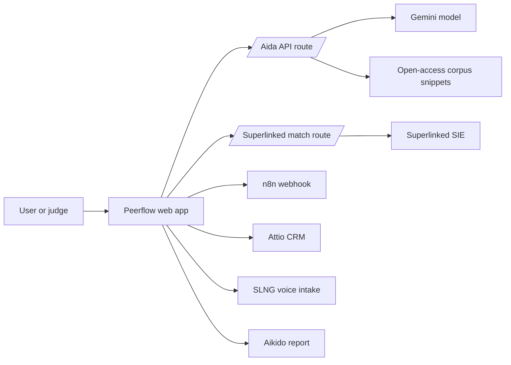

# Peerflow

Agentic CRM for open-access research publishing.

## Badges

No CI, coverage or deployment badges are configured yet.

## Description

Peerflow is a hackathon MVP for the Attio Agentic CRM track. It helps
open-access publishers and research communities intake papers, manage authors,
match reviewers, automate review workflows and answer research questions from
cited corpus evidence.

The app is built as a judge-facing demo. It can run fully in mock mode, while
real integrations are enabled through environment variables. The project is
explicitly not a Sci-Hub clone: it does not bypass paywalls and should only use
legal open-access metadata, abstracts and authorised links.

## Table of Contents

- [Features](#features)
- [Tech Stack](#tech-stack)
- [Architecture Overview](#architecture-overview)
- [Installation](#installation)
- [Usage](#usage)
- [Configuration](#configuration)
- [Screenshots or Demo](#screenshots-or-demo)
- [API Reference](#api-reference)
- [Tests](#tests)
- [Roadmap](#roadmap)
- [Contributing](#contributing)
- [Licence](#licence)
- [Contact or Support](#contact-or-support)

## Features

- Paper intake for legitimate open-access research sources.
- Attio-centred CRM workflow for authors, institutions, papers and review
  stages, with live workspace validation when configured.
- Superlinked SIE reviewer matching using open-source reranking.
- Aida, a corpus-grounded assistant with a no-citation, no-claim rule.
- n8n webhook triggering during the agent workflow when configured.
- SLNG and Aikido readiness indicators for the hackathon side challenges.
- Mock-first demo data so the product works without live credentials.
- Server-side API routes that keep API keys out of the browser.

## Tech Stack

- Node.js `>=22.13.0`
- Next.js `16.2.6`
- React `19.2.6`
- vinext `0.0.50`
- Vite `8.0.13`
- Tailwind CSS `4.2.1`
- TypeScript `5.9.3`
- Superlinked SIE SDK `0.6.14`
- Drizzle ORM `0.45.2` with optional D1 scaffolding
- Cloudflare Worker-compatible Sites build output

## Architecture Overview



The web app renders the demo surface and calls server-side API routes for model
work. Aida answers from cited corpus snippets through the Gemini-backed route,
while reviewer matching is reranked through Superlinked SIE. Attio is validated
through a read-only server route, and n8n can receive the workflow payload from
the agent run. SLNG and Aikido are configured through environment variables so
live services can be plugged in without exposing credentials to the browser.

## Installation

Clone the repository and install the locked dependencies:

```bash
git clone git@github.com:MasteraSnackin/Peerflow.git
cd Peerflow
npm ci
```

The project requires Node.js `>=22.13.0`.

## Usage

Start the local development server:

```bash
npm run dev
```

Open the app:

```text
http://localhost:3000/
```

Useful commands:

```bash
npm run lint
npm run build
npm run start
npm run db:generate
```

Typical demo flow:

1. Open Peerflow locally.
2. Ask Aida a supported research question and show the cited evidence trace.
3. Ask Aida an unsupported question and show the refusal behaviour.
4. Click `Run agent`.
5. Show Attio workspace validation, Superlinked reviewer matching and the
   Attio-style pipeline state.
6. Show the n8n workflow trigger result in the agent log.
7. Explain how SLNG and Aikido fit into the workflow once connected.

## Configuration

Create `.env.local` from `.env.example` and fill in only the services you want
to run live.

```bash
ATTIO_API_KEY=
ATTIO_WORKSPACE_ID=
N8N_WEBHOOK_URL=
SLNG_API_KEY=
SUPERLINKED_ENDPOINT=
SUPERLINKED_API_KEY=
SUPERLINKED_RERANK_MODEL=cross-encoder/ms-marco-MiniLM-L-6-v2
SUPERLINKED_GPU=l4
SUPERLINKED_TIMEOUT_MS=45000
SUPERLINKED_PROVISION_TIMEOUT_MS=90000
AIKIDO_REPORT_URL=
GEMINI_API_KEY=
AIDA_MODEL_API_KEY=
AIDA_GEMINI_MODEL=gemini-3.5-flash
AIDA_VECTOR_INDEX_URL=
AIDA_EMBEDDING_MODEL=
OPENALEX_EMAIL=
UNPAYWALL_EMAIL=
SEMANTIC_SCHOLAR_API_KEY=
```

Environment variable notes:

| Variable | Purpose |
| --- | --- |
| `ATTIO_API_KEY` | Attio API key for workspace validation and future CRM writes. |
| `ATTIO_WORKSPACE_ID` | Target Attio workspace identifier. |
| `N8N_WEBHOOK_URL` | n8n webhook triggered during the agent workflow. |
| `SLNG_API_KEY` | SLNG voice intake integration. |
| `SUPERLINKED_ENDPOINT` | SIE cluster endpoint. |
| `SUPERLINKED_API_KEY` | SIE authentication key. |
| `SUPERLINKED_RERANK_MODEL` | Reviewer reranking model. |
| `SUPERLINKED_GPU` | SIE GPU lane, default `l4`. |
| `AIKIDO_REPORT_URL` | Link to repository security report. |
| `GEMINI_API_KEY` | Gemini API key for Aida. |
| `AIDA_MODEL_API_KEY` | Alternative Gemini key name for Aida. |
| `AIDA_GEMINI_MODEL` | Gemini model used by Aida. |
| `AIDA_VECTOR_INDEX_URL` | Future vector index for the research corpus. |
| `AIDA_EMBEDDING_MODEL` | Future embedding model for corpus retrieval. |
| `OPENALEX_EMAIL` | Optional OpenAlex polite-pool contact. |
| `UNPAYWALL_EMAIL` | Optional Unpaywall API contact. |
| `SEMANTIC_SCHOLAR_API_KEY` | Optional Semantic Scholar API key. |

Do not commit `.env.local`. The repository ignores local environment files by
default.

## Screenshots or Demo

Local demo URL:

```text
http://localhost:3000/
```

Deployment URL:

```text
<ADD DEPLOYED URL>
```

Suggested demo line:

> Peerflow turns open-access publishing into an agentic CRM workflow, and Aida
> answers research questions only when it can cite corpus evidence.

## API Reference

### `POST /api/aida`

Runs Aida against the current mock corpus. If a Gemini key is configured, the
route asks Gemini to answer using only the cited evidence. If the selected
question has no supporting citations, Aida refuses before calling the model.

Request:

```json
{
  "questionId": "clinical-triage"
}
```

Response:

```json
{
  "answer": "string",
  "confidence": "High",
  "coverage": "1 cited passage",
  "citations": ["C1"],
  "mode": "live",
  "source": "gemini-3.5-flash"
}
```

### `POST /api/superlinked/match-reviewers`

Reranks reviewer profiles against a selected paper through Superlinked SIE.
Falls back to local mock reviewer scores if SIE is unavailable, cold or missing
credentials.

Request:

```json
{
  "paperId": "paper-01"
}
```

Response:

```json
{
  "matches": [
    {
      "name": "Amara Osei",
      "institution": "Imperial College London",
      "speciality": "Clinical retrieval",
      "fit": 96,
      "availability": "2 reviews open"
    }
  ],
  "mode": "live",
  "source": "cross-encoder/ms-marco-MiniLM-L-6-v2"
}
```

### `GET /api/attio/status`

Validates that the configured Attio key can read workspace objects. This is a
read-only check; it does not create CRM records.

Response:

```json
{
  "mode": "live",
  "source": "2 Attio objects available",
  "objects": ["companies", "people"]
}
```

### `POST /api/n8n/trigger`

Sends the selected paper and reviewer matches to the configured n8n webhook.
If the webhook is missing or unavailable, the route returns a mock/fallback
result so the demo flow can continue.

Request:

```json
{
  "paperId": "paper-01",
  "stage": "reviewer-matched",
  "reviewers": [
    {
      "name": "Amara Osei",
      "institution": "Imperial College London",
      "speciality": "Clinical retrieval",
      "fit": 96
    }
  ]
}
```

Response:

```json
{
  "mode": "live",
  "source": "n8n webhook accepted workflow payload",
  "runId": "00000000-0000-4000-8000-000000000000"
}
```

## Tests

There is no dedicated test suite yet.

Current verification commands:

```bash
npm run lint
npm run build
```

Known dependency note: `npm ci` currently reports audit findings inherited from
the starter dependency tree. They have not been auto-fixed because forced audit
fixes may change framework dependencies shortly before the demo.

## Roadmap

- Write real Attio records for authors, institutions, papers and review tasks.
- Promote the n8n trigger from demo payloads to durable workflow run tracking.
- Add SLNG voice recording and transcript parsing.
- Replace mock corpus snippets with a real vector index.
- Attach Aikido scan evidence inside the app.
- Add automated tests for API routes and core UI states.
- Deploy a public demo URL.

## Contributing

Contributions are welcome once the repository is public and the hackathon
submission is stable.

Suggested contribution flow:

1. Create a feature branch.
2. Make a focused change.
3. Run `npm run lint` and `npm run build`.
4. Open a pull request with a short description and screenshots for UI changes.

Do not include API keys, `.env.local` or other secrets in commits.

## Licence

`<ADD LICENCE>`

No licence file is currently present in the repository.

## Contact or Support

Repository: `https://github.com/MasteraSnackin/Peerflow`

Maintainer/contact:

```text
<ADD CONTACT>
```
