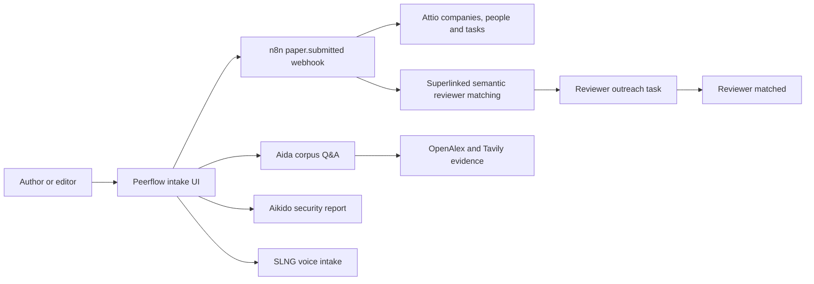
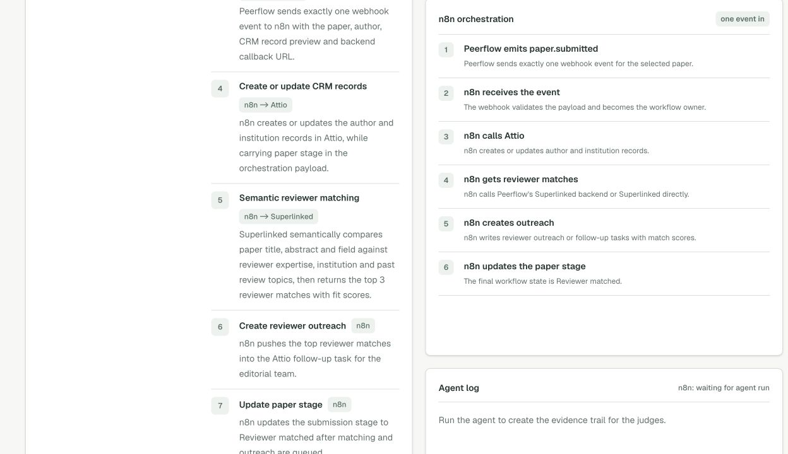

# Sponsor Usage

Peerflow is an agentic CRM workflow for legal open-access research publishing.
The sponsor integrations are used in the end-to-end flow from paper intake to
reviewer matching and follow-up.

## Summary

| Sponsor or service | How Peerflow uses it | Current proof |
| --- | --- | --- |
| Attio | CRM layer for authors, institutions and follow-up tasks. | Live REST API read/write is working. `npm run attio:seed` created demo companies, people and reviewer outreach tasks in the Attio workspace. |
| n8n | Orchestration layer. Peerflow sends one `paper.submitted` event to n8n, then n8n is designed to own Attio writes, reviewer matching, outreach or follow-up tasks, and the `Reviewer matched` stage update. | Configured, but latest deployed production webhook check returned `404`; activate/publish the workflow or correct the production webhook path. Live canvas: [Peerflow n8n workflow](https://peerflow.app.n8n.cloud/workflow/jzwLgV8qqsVSPM9u?projectId=7UmZAgpCylS4FmJs&uiContext=workflow_list). Importable workflow file: `n8n/peerflow-hackathon-orchestration.json`. |
| Superlinked | Semantic reviewer matching through Superlinked's open-source inference engine. Peerflow embeds paper title, abstract and field with `all-MiniLM-L6-v2`, embeds reviewer expertise, institution and past review topics, then reranks with `ms-marco-MiniLM-L-6-v2`. With `SUPERLINKED_ADMIN_TOKEN`, the route requests a pinned SIE model pool before matching. | The reviewer panel shows top 3 matches with fit scores, such as `Amara Osei, 94% fit`, and explains this is semantic matching rather than keyword search. n8n pushes those matches into the Attio follow-up task payload. |
| Tavily | Open-access source discovery and extraction for Aida's live corpus. | `/api/tavily/discover` searches allowed open-access-friendly domains and extracts source snippets. It returns `empty` rather than default test data if no allowed live source is found. |
| SLNG | Author voice intake. In Peerflow, the author records a submission request; `/api/slng/intake` sends the audio to SLNG STT; Peerflow extracts title, field, author, institution and summary; that becomes the paper intake record. | The app has a microphone voice-intake panel. The agent log shows `Voice intake parsed by SLNG`, then the structured paper record is visible in the voice panel and Attio record preview. |
| Aikido | Security evidence for the side challenge. | The app links to the configured Aikido audit report from the integration readiness grid. |
| Aida / Gemini | Corpus-grounded research assistant. | Aida retrieves OpenAlex/Tavily evidence, validates citations, refuses unsupported patient-specific treatment advice and can read answers aloud with browser speech synthesis. |

## End-to-End Workflow

Peerflow keeps API keys server-side and only shows configuration state in the
browser. The public demo does not bypass paywalls and is scoped to legal
open-access metadata, abstracts and authorised links.

## Screenshots

### Sponsor Readiness

This screenshot shows the configured sponsor grid in the app: Attio, n8n,
SLNG, Superlinked, Tavily, Aikido and Aida.

### Agent Workflow

This screenshot shows the agent workflow surface where Peerflow submits a paper
once, then hands off CRM, reviewer matching and outreach orchestration to n8n.

### n8n Orchestration Proof

In Peerflow, n8n is used as the orchestration layer:

1. Peerflow sends one webhook event: `paper.submitted`.
2. n8n receives the event and validates the paper payload.
3. n8n calls Attio to create or update author and institution records.
4. n8n calls Superlinked, or Peerflow's Superlinked backend route, to get the
   top reviewer matches.
5. n8n creates reviewer outreach or follow-up tasks with the match scores.
6. n8n updates the paper stage to `Reviewer matched`.

The same sequence is shown in the app and carried in the `paper.submitted`
payload under `orchestration.contract`.

Live workflow canvas for judges:
[peerflow.app.n8n.cloud/workflow/jzwLgV8qqsVSPM9u](https://peerflow.app.n8n.cloud/workflow/jzwLgV8qqsVSPM9u?projectId=7UmZAgpCylS4FmJs&uiContext=workflow_list).

### SLNG Intake Proof

This screenshot shows the proof judges asked for in the agent log:
`Voice intake parsed by SLNG`. The Agent Workflow screenshot above shows the
structured paper record with title, author, institution, field and summary.
The current app also includes a microphone voice-intake panel that calls
`/api/slng/intake`; that server route calls SLNG STT when `SLNG_API_KEY` is
configured and otherwise labels the fallback.

Voice output is separate from SLNG: Aida answers and the latest agent log can be
read aloud locally by the browser using speech synthesis.

### Superlinked Matching Proof

This screenshot shows the reviewer matches judges asked for: names and fit
scores such as `Amara Osei, 94% fit`. The app explains that Superlinked matches
paper title, abstract and field against reviewer expertise, institution and
past review topics, not simple keywords. The route uses Superlinked's
open-source inference engine with `all-MiniLM-L6-v2` for semantic embeddings and
`ms-marco-MiniLM-L-6-v2` for reranking. The server-only admin token is used to
request the `peerflow-reviewer-matching` pinned model pool when configured.

### Full Demo Page

This full-page capture is useful for judges who want to see Aida, the agent
workflow and integration readiness together.

## Live Evidence

- Attio REST API key was tested against the workspace objects endpoint.
- `npm run attio:seed` created live demo companies, people and follow-up tasks.
- The Attio developer webhook has been configured to point to the n8n production
  webhook and
  listens for `record.created`, `record.updated`, `task.created` and
  `task.updated`.
- On 27 June 2026, `npm run attio:seed` created live Attio follow-up tasks
  containing the Superlinked reviewer matches, fit scores, embedding model and
  rerank model.
- The Superlinked admin token is stored only in local/server env and is used for
  model-pool pinning, not exposed to the browser.
- The `peerflow-reviewer-matching` SIE pool readback reports active state with
  `all-MiniLM-L6-v2` and `ms-marco-MiniLM-L-6-v2` pinned on one L4 worker.
- Superlinked reviewer matches are carried into the n8n Attio outreach task
  payload so the CRM follow-up contains the top reviewer candidates.
- The `paper.submitted` payload includes the n8n orchestration contract used by
  the app and workflow JSON.
- `/api/slng/intake` returned a live SLNG transcript from a WAV voice sample and
  extracted the structured paper record for `paper-01`.
- Latest deployed n8n production webhook check returned `404`; this must be
  activated/published or corrected before using n8n as live proof.
- The live n8n workflow URL is recorded in the app through
  `N8N_WORKFLOW_URL` and appears as `Open workflow` for judges.
- `npm run lint` and `npm run build` pass.

## Known Gaps

- The repository can verify the importable n8n workflow JSON and records the
  live n8n Cloud canvas URL, but the configured production webhook currently
  returns `404`. Exact node parity with the JSON remains a manual n8n UI check.
- There is no custom Attio `paper` object yet. Paper stage is carried in the
  orchestration payload rather than stored as a native Attio paper record.
- Native Attio visual Workflow/Sequence setup is not implemented.
- SLNG voice capture is implemented through the browser microphone and
  `/api/slng/intake`; arbitrary author submissions still need stronger field
  extraction beyond the hackathon demo records.
- `PEERFLOW_PUBLIC_URL` is configured to the deployed Vercel app so n8n Cloud
  can call the reviewer-matching backend outside localhost.
