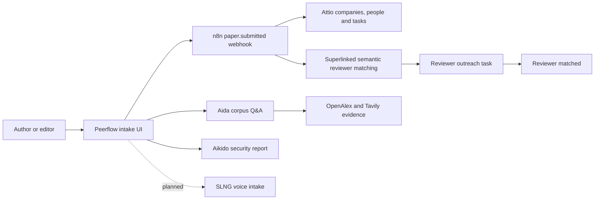
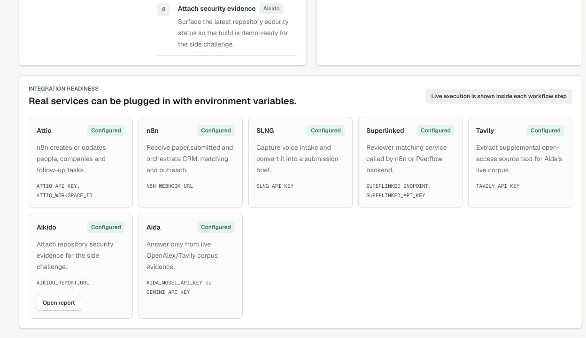
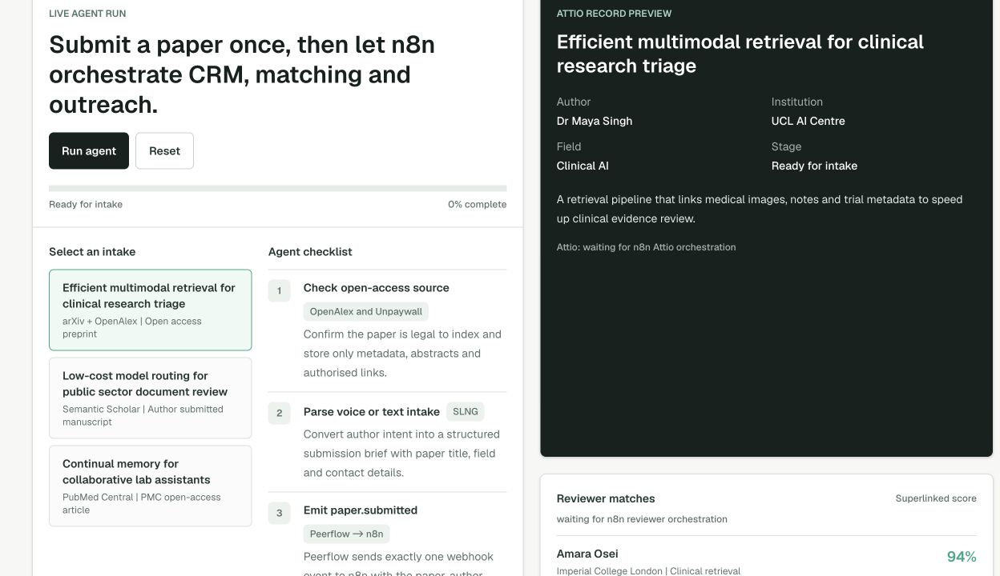
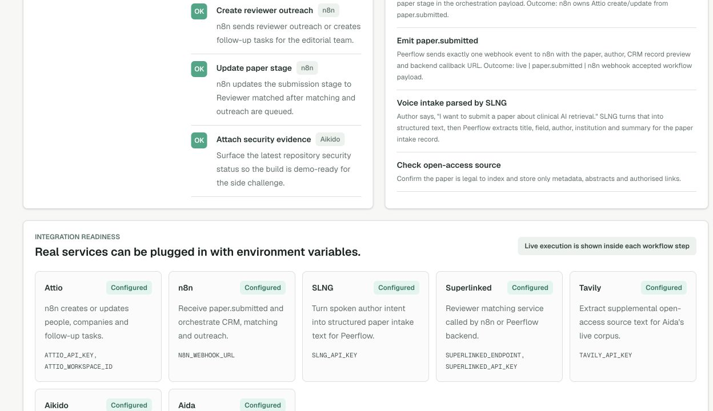
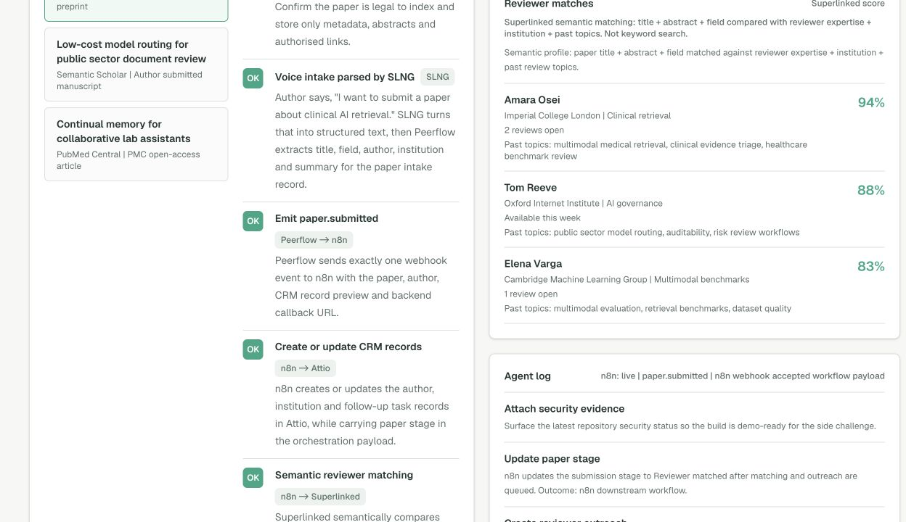
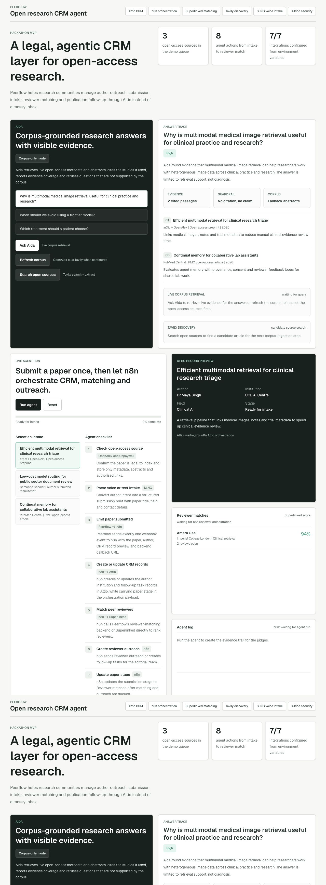

# Sponsor Usage

Peerflow is an agentic CRM workflow for legal open-access research publishing.
The sponsor integrations are used in the end-to-end flow from paper intake to
reviewer matching and follow-up.

## Summary

| Sponsor or service | How Peerflow uses it | Current proof |
| --- | --- | --- |
| Attio | CRM layer for authors, institutions and follow-up tasks. | Live REST API read/write is working. `npm run attio:seed` created demo companies, people and reviewer outreach tasks in the Attio workspace. |
| n8n | Orchestration layer. Peerflow sends one `paper.submitted` event to n8n, then n8n owns CRM writes, reviewer matching, outreach and stage updates. | Production webhook returns `200` and starts the workflow. Importable workflow file: `n8n/peerflow-hackathon-orchestration.json`. |
| Superlinked | Semantic matching between papers and reviewers. Peerflow embeds the paper title, abstract and field, then matches against reviewer expertise, institution and past review topics. | The reviewer panel shows top 3 matches with fit scores, such as `Amara Osei, 94% fit`, and explains this is semantic matching rather than keyword search. n8n pushes those matches into the Attio follow-up task payload. |
| Tavily | Open-access source discovery and extraction for Aida's live corpus. | `/api/tavily/discover` searches allowed open-access-friendly domains and extracts source snippets. |
| SLNG | Author voice intake. In Peerflow, the author says, "I want to submit a paper about clinical AI retrieval"; SLNG turns that into structured text; Peerflow extracts title, field, author, institution and summary; that becomes the paper intake record. | The agent log shows `Voice intake parsed by SLNG`, then the structured paper record is visible in the Attio record preview. Production voice capture is still a planned step. |
| Aikido | Security evidence for the side challenge. | The app links to the configured Aikido audit report from the integration readiness grid. |
| Aida / Gemini | Corpus-grounded research assistant. | Aida retrieves OpenAlex/Tavily evidence, validates citations and refuses unsupported patient-specific treatment advice. |

## End-to-End Workflow

Peerflow keeps API keys server-side and only shows configuration state in the
browser. The public demo does not bypass paywalls and is scoped to legal
open-access metadata, abstracts and authorised links.

## Screenshots

### Sponsor Readiness

This screenshot shows the configured sponsor grid in the app: Attio, n8n,
SLNG, Superlinked, Tavily, Aikido and Aida.

### Agent Workflow

This screenshot shows the agent workflow surface where Peerflow submits a paper
once, then hands off CRM, reviewer matching and outreach orchestration to n8n.

### SLNG Intake Proof

This screenshot shows the proof judges asked for in the agent log:
`Voice intake parsed by SLNG`. The Agent Workflow screenshot above shows the
structured paper record with title, author, institution, field and summary.

### Superlinked Matching Proof

This screenshot shows the reviewer matches judges asked for: names and fit
scores such as `Amara Osei, 94% fit`. The app explains that Superlinked matches
paper title, abstract and field against reviewer expertise, institution and
past review topics, not simple keywords.

### Full Demo Page

This full-page capture is useful for judges who want to see Aida, the agent
workflow and integration readiness together.

## Live Evidence

- Attio REST API key was tested against the workspace objects endpoint.
- `npm run attio:seed` created live demo companies, people and follow-up tasks.
- The active Attio developer webhook points to the n8n production webhook and
  listens for `record.created`, `record.updated`, `task.created` and
  `task.updated`.
- On 27 June 2026, `npm run attio:seed` created three live Attio follow-up
  tasks containing the Superlinked reviewer matches and fit scores.
- Superlinked reviewer matches are carried into the n8n Attio outreach task
  payload so the CRM follow-up contains the top reviewer candidates.
- The n8n production webhook returns `200` with `Workflow was started`.
- `npm run lint` and `npm run build` pass.

## Known Gaps

- The prepared n8n workflow still needs to be imported and published from a
  signed-in n8n Cloud session.
- There is no custom Attio `paper` object yet. Paper stage is carried in the
  orchestration payload rather than stored as a native Attio paper record.
- Native Attio visual Workflow/Sequence setup is not implemented.
- SLNG voice capture is represented in the product flow, configuration model
  and agent log proof, but the production voice-intake endpoint is not
  implemented yet.
- `PEERFLOW_PUBLIC_URL` is still needed for n8n Cloud to call the local
  reviewer-matching backend outside localhost.
