# Peerflow Architecture Diagrams

These diagrams are written in Mermaid so they can render directly on GitHub.
They describe the current hackathon MVP. Where the implementation is still a
demo path, the diagrams keep that boundary explicit.

## C1: System Context

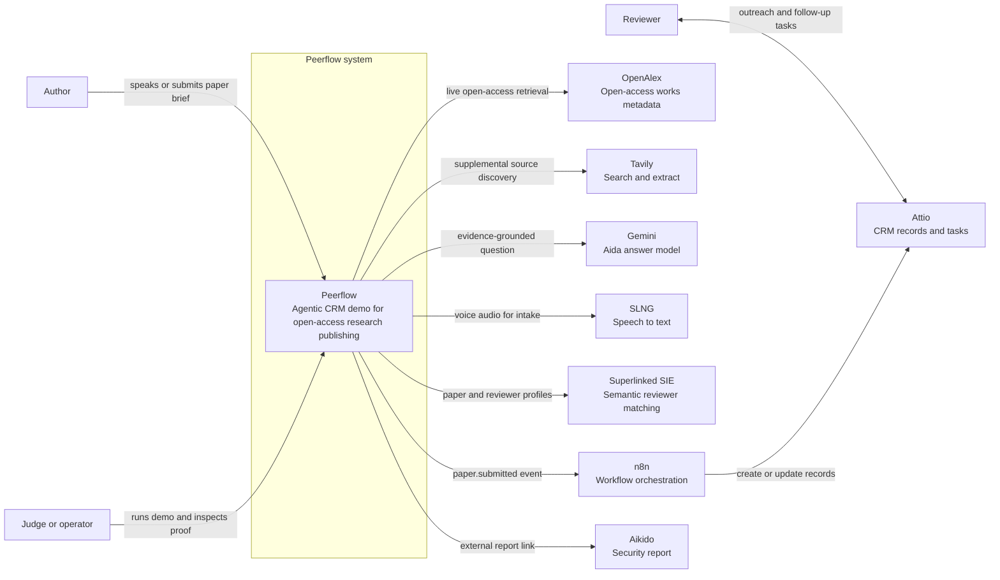

## C2: Container Diagram

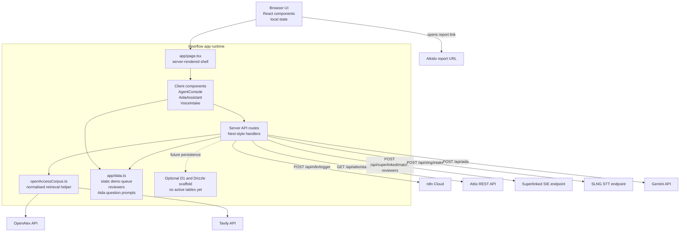

## C3: Component Diagram

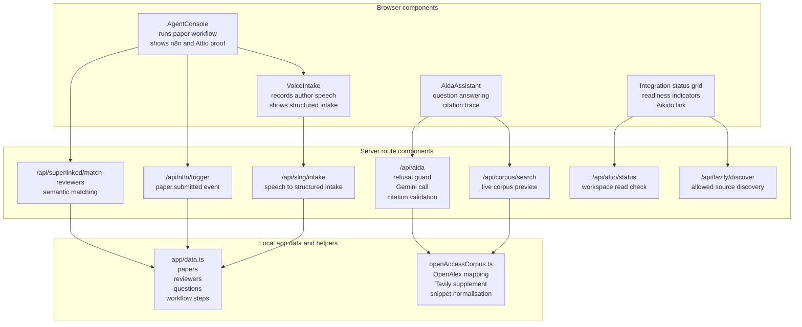

## C4: Code-Level Route View

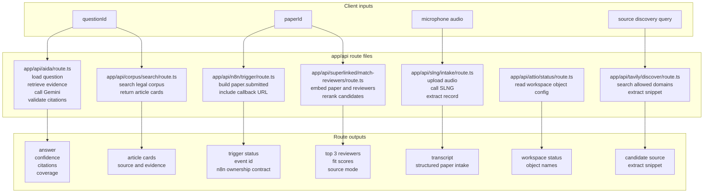

## Data Flow: End-to-End Agent Workflow

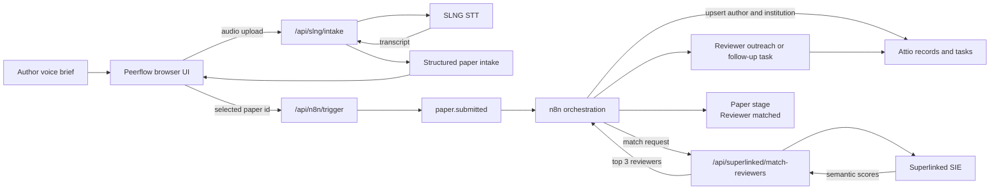

## Data Flow: Aida Evidence-Grounded Answering

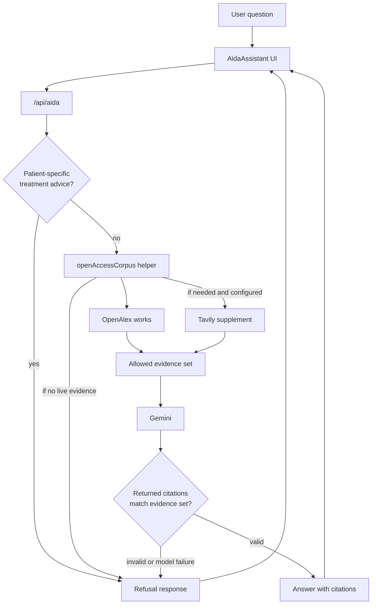

## Sequence: Agent Orchestration Through n8n

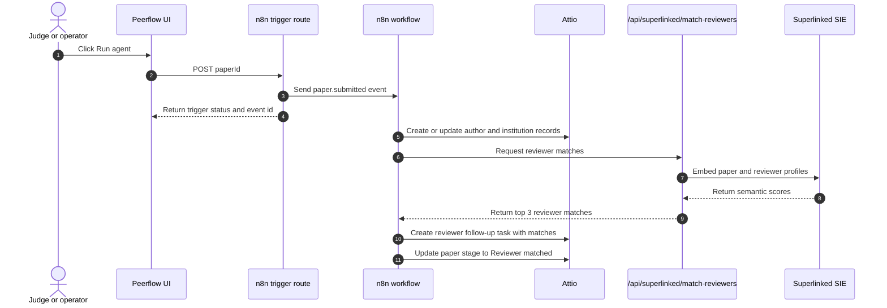

## Sequence: SLNG Voice Intake

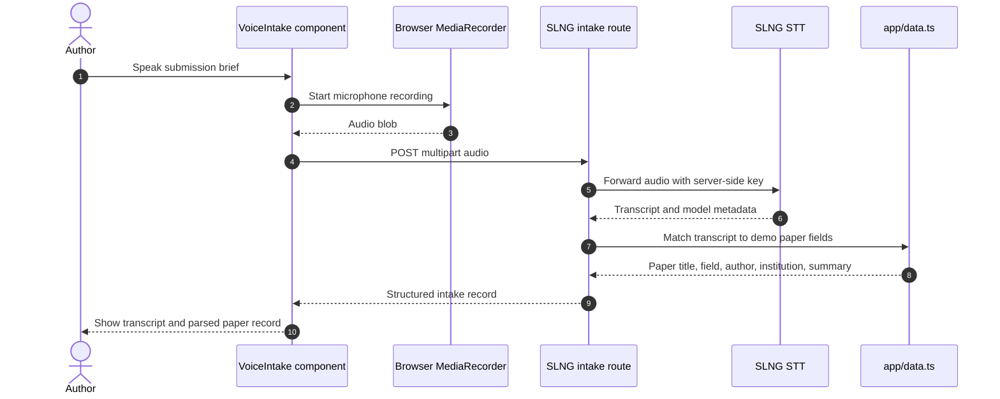

## Sequence: Aida Question Answering

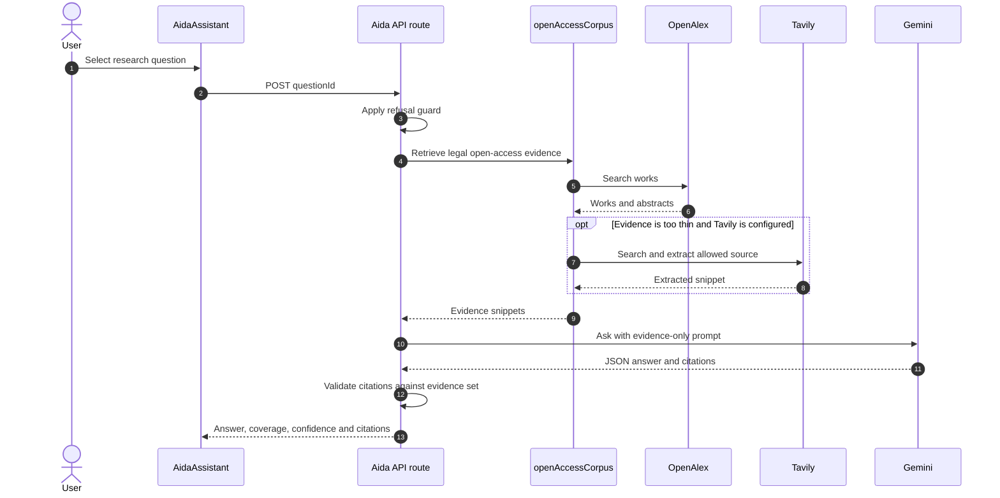

## Sequence: Superlinked Reviewer Matching

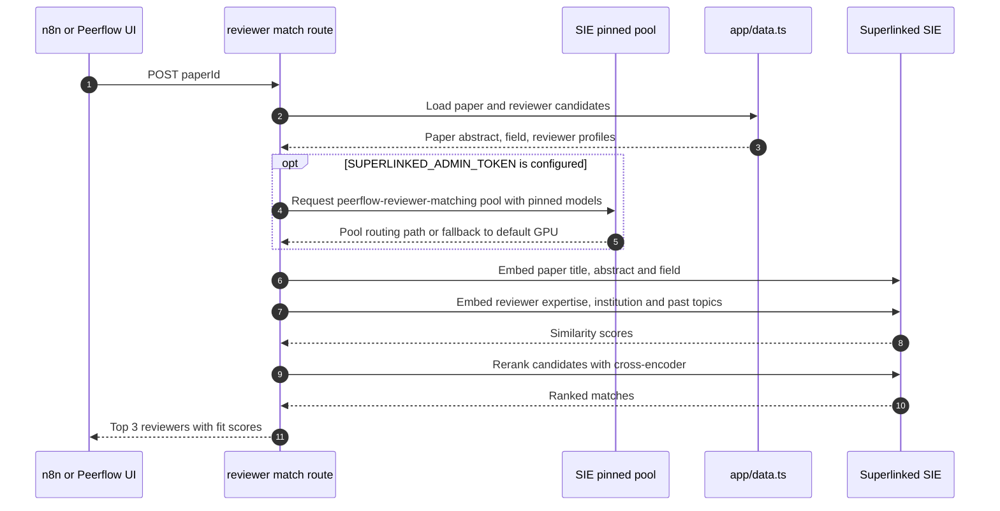

## n8n Workflow Ownership

Live n8n canvas:
[peerflow.app.n8n.cloud/workflow/jzwLgV8qqsVSPM9u](https://peerflow.app.n8n.cloud/workflow/jzwLgV8qqsVSPM9u?projectId=7UmZAgpCylS4FmJs&uiContext=workflow_list).

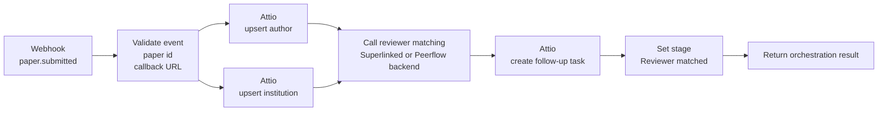

## Paper State Diagram

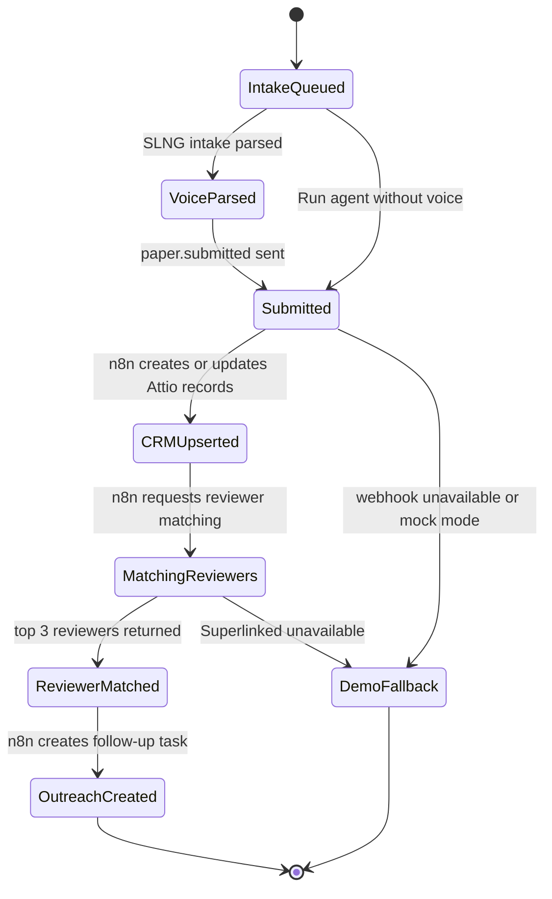

## Conceptual Data Model

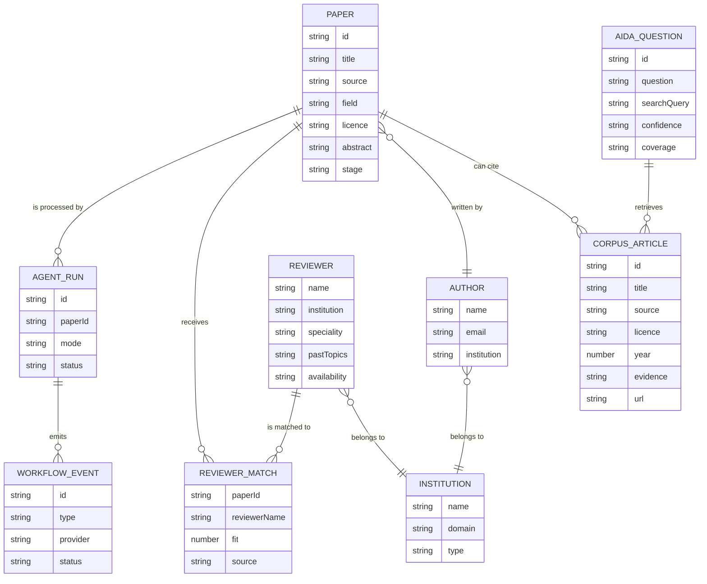

Current implementation note: the main app still uses static data and browser
state for most workflow data. This model is the natural durable schema for the
next build step, not a claim that every entity is persisted today.

## Trust Boundary and Secrets

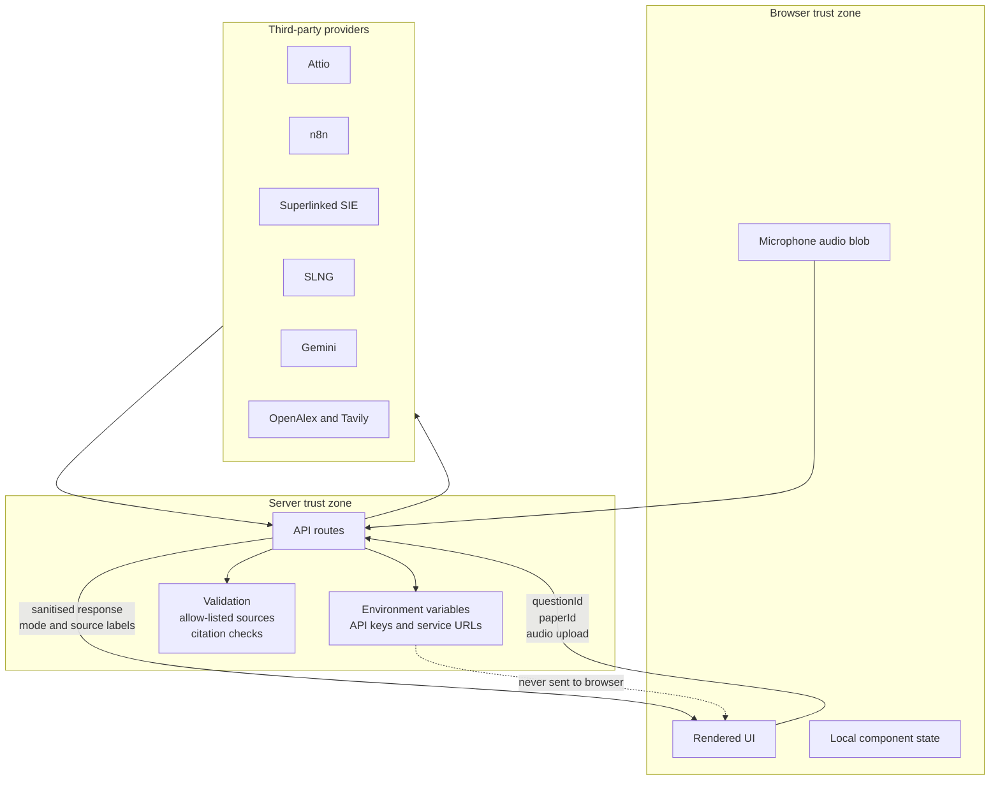

## Deployment and Runtime View

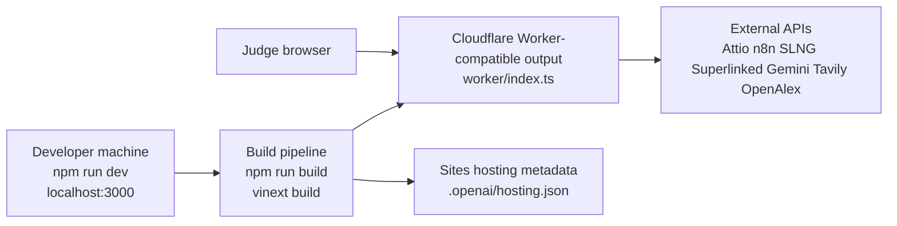

## Failure and Fallback Behaviour

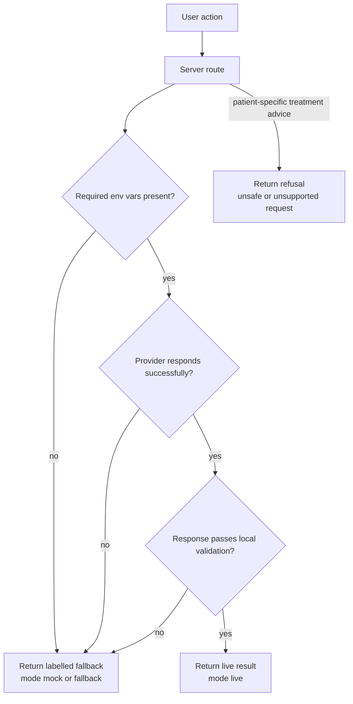

## Demo Proof Map

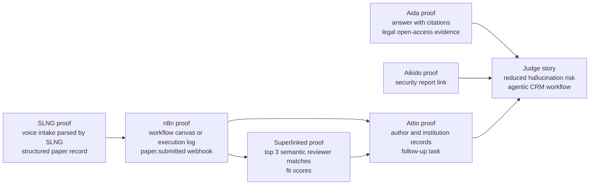
